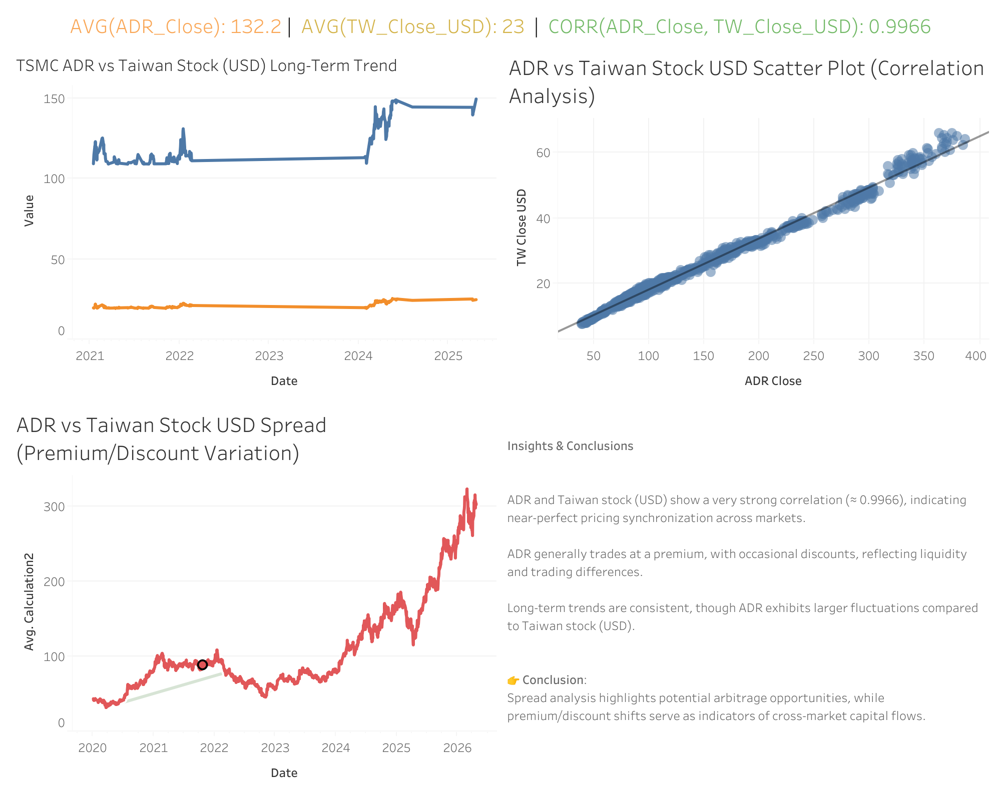

# 台積電 ADR vs 台股價差分析

## 專案簡介
**為何台積電ADR長期相較台股存在溢價？此價差是否具有可交易性？** 透過分析台積電ADR (NYSE: TSM) 與台股(TWSE: 2330)之間的價格差異，並探討其成因與是否存在可行的交易策略。

---
## 交易策略

基於 **均值回歸** 假設，設計簡單交易策略：

### 策略邏輯
- 當 Z-score > 2  
  → 做空 ADR / 做多台股（價差過高，預期回落）

- 當 Z-score < -2  
  → 做多 ADR / 做空台股（價差過低，預期回升）

---

## 交易意涵
- 當價差偏離歷史區間時，可能存在均值回歸機會
- 可採用：
  - 做多低估市場
  - 做空高估市場

⚠️ 需注意：
  - ADR 與台股之間存在轉換限制
  - 市場摩擦（交易成本、流動性）會影響套利效果

---
## 核心發現
- **ADR長期存在15%–25%溢價**
- **價差具有持續性**，不易完全套利
- 價差受以下因素影響：
  - 匯率
  - 美股市場情緒（特別是科技股）
  - 市場流動性差異

---
## 視覺化成果

👉 [查看進階分析儀表板] [(https://public.tableau.com/views/TSMCADRvsTaiwanStockMarketAnalysis20202026/Dashboard1?:language=en-US&:sid=&:redirect=auth&:display_count=n&:origin=viz_share_link)]

<small>👉 English version [(https://github.com/hlr95035339/TSMC_ADR_vs_Taiwan_Stock.git)]</small>

---

## 專案價值
展示從數據分析到投資策略的完整流程：
- 建立金融市場價差分析能力
- 設計與驗證交易策略
- 評估風險與報酬（Sharpe Ratio）
---

## 分析內容
- ADR vs 台股價格走勢比較
- 價差時間序列分析
- 價差分布
- 滾動平均
- Z-score 標準化分析

---
## 回測結果
- 累積報酬
- 勝率
- 最大回撤

## 風險調整報酬
- 衡量「每單位風險帶來的報酬」
- Sharpe Ratio 越高，代表策略越穩定且有效

----
## 數據來源
- 台股：台積電（2330）
- 美股：TSMC ADR（TSM）
- 匯率：USD/TWD
---

## 技能展示
- EDA 資料分析
- Time Series 時間序列分析
- Backtesting 交易策略設計
- Sharpe Ratio 風險評估
- Python 數據分析
